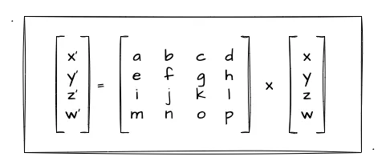
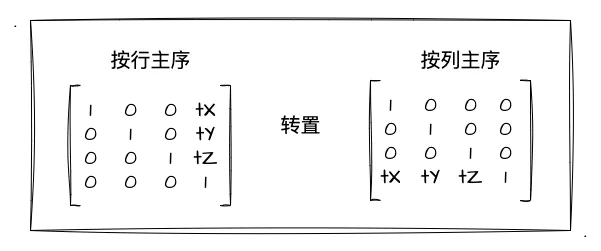

# 几何变换

:::tip 二维动画
在上一章节中，我们已经使用 WebGL 成功绘制了不同的形状，如点，线，三角形，多边形等等，但这些都是静态的图形，这一节主要的内容就是让图形动起来。

怎样才能让图形动起来呢，不卖关子了，其实就是给图形做几何变换，如平移，旋转，缩放等等，相信作为前端的小伙伴一定很熟悉，还记得 CSS 中的那些动画效果吗，这里的二维动画其实和 CSS 中的动画效果很类似，只是这里不是通过 CSS 来实现的，而是通过 WebGL 来实现的。

:::

下面将以一个三角形为例，对这个三角形做一个几何变化，观察一下效果吧。

## 平移变换

<Geometric :optType="OptTypes.TRANSLATION" />
<script setup>
    import Geometric from '../components/demo/Geometric.vue'
    import {OptTypes} from '../components/types.ts'
</script>

上面这个例子是通过改变 x,y 的值来实现图形的平移的，我们看一下代码：

```js 着色器源码
//顶点着色器源码
var vertexShaderSource = `
        // 定义了一个名为 a_Position，类型为 vec4 的 attribute 变量
        attribute vec4 a_Position;
        attribute vec4 a_Color;
        varying vec4 v_Color;
        uniform vec4 u_Position; // 定义平移位置变量
        uniform float u_Scale; // 定义缩放变量
        void main () {
            gl_Position = a_Position + u_Position; // 顶点坐标
            v_Color= a_Color;
        }
        `
//片元着色器源码
var fragShaderSource = `
            precision mediump float;
            varying vec4 v_Color;
            void main () {
            gl_FragColor = v_Color;// 顶点颜色 (R, G, B, A)
        }
      `
```

实现平移效果，如从(x,y)平移到(x',y'),其实就是 x 加上水平方向的移动距离，y 加上垂直方向的移动距离，所以，我们只需要在顶点着色器中，把 x,y 加上一个偏移量，即可实现平移的效果。

## 缩放变换

对于缩放，其实也是对顶点坐标做转换,分别对 x,y 值乘上缩放比例：

```js
const vertexCode = `
  attribute vec4 a_Position;
  attribute vec4 a_Color;
  varying vec4 v_Color;
  // float 类型的 u_Scale，代表缩放比例
  uniform float u_Scale;

  void main () {
    // 将 x 、y 的值同时乘上缩放比例（注意 z 轴的值为 0 和 w 的值为 1）
    gl_Position = vec4(a_Position.x * u_Scale, a_Position.y * u_Scale, 0., 1.);
    v_Color= a_Color;
  }
`
```

## 旋转变换

旋转变换，其实也是对顶点坐标做转换，但是旋转变换比较复杂，需要利用到一个转轴公式，这里直接给出结果，在图形学中的数学那一小节已经详细介绍过公式的推导

:::tip 二维转轴公式
x' = x*cos(b) - y*sin(b)  
y' = y*cos(b) + x*sin(b)
:::

```js
// 弧度值 u_Rotate
uniform float u_Rotate;
// 顶点坐标套入转轴计算公式
gl_Position = vec4(
  // x * cos - y * sin
  a_Position.x * cos(u_Rotate) - a_Position.y * sin(u_Rotate),
  // x * sin + y * cos
  a_Position.x * sin(u_Scale) + a_Position.y * cos(u_Rotate),
  0.,
  1.
);
```

## 使用矩阵实现图形变换

对于上面已经实现的二维图形几何变换，如平移，其实就是两个矢量数据相加，本质就是两个矢量相加来实现平移效果，而对于旋转，它是通过转轴公式来计算旋转后的 x,y 值来实现旋转效果。虽然这种方式可以实现几何变换，但是他们都有一个问题，那就是每要实现一个效果都要写一份 shader，当我们需要复杂的复合变换的时候，这种方法可能就不太适用，那矩阵就是一个非常适合做图形变换的工具。

### 矩阵的应用推导

使用矩阵代替数学公式实现图形的二维变换。

首先大家看一张图：



这其实是矩阵与矢量的乘法，我们可以通过定义一个矩阵，乘上我们的顶点坐标，就可以得到新的矢量值(x', y', z', w')。

根据矩阵的乘法公式，我们可以得到如下等式：

```js
x' = ax + by + cz + dw
y' = ex + fy + gz + hw
z' = ix + jy + kz + lw
w' = mx + ny + oz + pw
```

比如说 x 轴的平移，即 x 到 x'，只需要关心 x 轴中产生的平移距离即可，因此，我们可以得到：

```sh
a = 1,b = 0, c = 0, dw = tX
e = 0,f = 1, y = 0, hw = tY
i = 0,j = 0, k = 1, lw = tZ
m = 0,n = 0, o = 0, p = w
```

因此可以得到平移矩阵为：


上面的对角线为 1 的 4\*4 的矩阵就是**变换矩阵**，之后做图形的几何变换的时候，可以利用这个变换矩阵乘矢量进行计算。

### 使用矩阵实现平移

```js
const vertexCode = `
  attribute vec4 a_Position;
  attribute vec4 a_Color;
  varying vec4 v_Color;
  uniform mat4 u_TranslateMatrix; //平移矩阵

  void main () {
    // 直接改成：矩阵 x 矢量
    gl_Position = u_TranslateMatrix * a_Position;
    v_Color= a_Color;
  }
`
```

这段着色器代码跟之前使用矢量相加不同的是，这里使用矩阵乘矢量的方式实现平移，因此如果要实现 x 轴的平移，只需要不断改变 x 的值就可以了。但还需要注意：**WebGL 矩阵是列主序**



因此我们定义矩阵只需要把推导后的平移矩阵转置就可以了。

### 复合变换

上一节我们使用矩阵乘矢量实现了平移，现在我们来看一下平移+旋转的复合变换：

平移：

```js
// 平移矩阵 x 顶点坐标
gl_Position = u_TranslateMatrix * a_Position
```

旋转：

```js
// 旋转矩阵 x 顶点坐标
gl_Position = u_RotateMatrix * a_Position
```

平移+旋转:

```js
// 旋转矩阵 x 平移后的坐标矢量
gl_Position = u_RotateMatrix * (u_TranslateMatrix * a_Position)
// 根据矩阵乘法遵循结合律，可换算成：
// (旋转矩阵 x 平移矩阵) x 顶点坐标
gl_Position = u_RotateMatrix * u_TranslateMatrix * a_Position
```

我们知道行和列都相同的两个矩阵可以相乘，并且最终还是一个 m\*n 的矩阵，因此，我们还可以推导出复合变换矩阵的公式：

```js
// 模型矩阵 x 顶点坐标
gl_Position = u_ModelMatrix * a_Position
```
