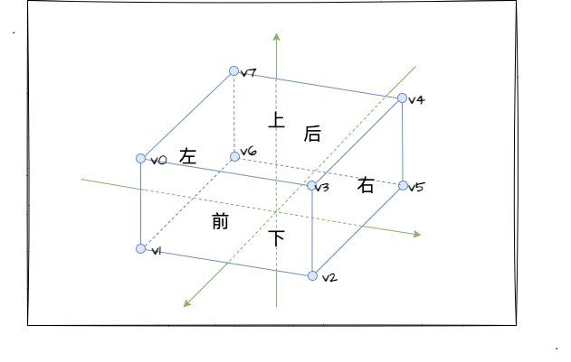

# WebGL 三维世界

:::tip
前面章节中，我们已经学习了`WebGL`的基本原理和基本使用，同时也使用`WebGL`进行了 2d 图形的绘制，现在我们将进入`WebGL`最重要的环节——3d 世界。

下面我将通过绘制一个立方体，在实战中打开`WebGL`3D 世界的大门。
:::

3D 和 2D 最大的不同就是 3D 多了一个 Z 轴。在绘制 2D 图形的时候，我们的流程就是创建顶点坐标，然后配置片元着色器进行着色处理，最后再调用`gl.drawArrays`函数进行绘制。绘制 3D 图形的时候，也可以按照这个逻辑，先定义顶点坐标，无非就是顶点左边不再是（x,y）,而是（x,y,z）.

假设我们要绘制一个立方体，按照 2D 图形的逻辑，我们可以通过`gl.drawArrays`绘制 36 个顶点，按照一个面绘制两个三角形进行绘制，不过这样做的缺点就是会有很多重复的顶点，实际上立方体只需要 8 个顶点就可以。因此，我们转换逻辑，看看有没有其他的 api 能够解决这个问题。

## `gl.drawElements`

`gl.drawElements`参数用法如下：

| 参数   | 参数值说明                                                                                                                         |
| ------ | ---------------------------------------------------------------------------------------------------------------------------------- |
| mode   | 绘制方式（跟 drawArrays 一样）。gl.POINTS、gl.LINE_STRIP、gl.LINE_LOOP，gl.LINES、gl.TRIANGLE_STRIP、gl.TRIANGLE_FAN、gl.TRIANGLES |
| count  | 需要绘制的顶点数(可理解为索引数组的长度)                                                                                           |
| type   | 指定索引值的数据类型                                                                                                               |
| offset | 偏移值。在索引数组中开始绘制的位置                                                                                                 |

`gl.drawElements`和`gl.drawArrays`是很类似的，只是`gl.drawElements`多了一个 type 参数（索引值的数据类型）。`gl.ELEMENT_ARRAY_BUFFER` 是用于元素索引 buffer 的 target，管理着具有索引结构的数据。对比 `gl.ARRAY_BUFFER` 来看，`gl.ARRAY_BUFFER` 是关乎存储在缓冲区中的顶点坐标、纹理坐标、颜色数据的 target。

因此，我们可以通过 `gl.drawElements` 来解决重复定义顶点的问题.

## 什么是索引

`gl.drawElements`需要配合索引来避免重复定义顶点，那么索引又是怎么定义的呢？



如上图所示，我给立方体每一个顶点都设置了一个标号，首先我们分析前，右这两个面，他们的顶点是 v0-v5，前这个面可由(v0,v1,v0),(v0,v2,v3)两个三角形组成，右这个面可由(v3,v2,v5)和(v3,v5,v4)两个三角形组成。

按照上面的编排逻辑，我们的顶点数据和索引数据如下：

:::details

```js
const vertices = new Float32Array([
  -0.5,
  0.5,
  0.5, // v0
  -0.5,
  -0.5,
  0.5, // v1
  0.5,
  -0.5,
  0.5, // v2
  0.5,
  0.5,
  0.5, // v3
  0.5,
  0.5,
  -0.5, // v4
  0.5,
  -0.5,
  -0.5, // v5
  -0.5,
  -0.5,
  -0.5, // v6
  -0.5,
  0.5,
  -0.5 // v7
]);

const indices = new Uint8Array([
  0,
  1,
  2,
  0,
  2,
  3, // 前
  3,
  2,
  5,
  3,
  5,
  4, // 右
  4,
  5,
  6,
  4,
  6,
  7, // 后
  7,
  0,
  6,
  0,
  1,
  6, // 左
  0,
  3,
  4,
  0,
  4,
  7, // 上
  1,
  2,
  5,
  1,
  5,
  6 // 下
]);
```

:::

## 绘制立方体

根据定义好的顶点坐标和索引数据，我们现在只需要把索引值存到 buffer 中，并且设置 targe 为`gl.ELEMENT_ARRAY_BUFFER`.

```js
const indexBuffer = gl.createBuffer();
gl.bindBuffer(gl.ELEMENT_ARRAY_BUFFER, indexBuffer);
gl.bufferData(gl.ELEMENT_ARRAY_BUFFER, indices, gl.STATIC_DRAW);
gl.enable(gl.DEPTH_TEST);
```

调用`gl.drawElements`进行绘制

```js
gl.drawElements(gl.TRIANGLES, indices.length, gl.UNSIGNED_BYTE, 0);
```

<Cube />
<script setup>
    import Cube from '../components/demo/Cube.vue'
</script>
