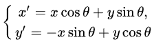

# 图形学中的数学

## 转轴公式

设坐标轴的旋转角为 θ，P 是平面的任意一点，在原坐标系 xOy 中的坐标为(x，y)，在新坐标系 x′Oy′中的坐标为(x′，y′)，则

 或 

叫做坐标轴的旋转公式，简称转轴公式。

矩阵形式：


## 旋转公式推导

如下图所示：假设起始点为 p(x,y),旋转后的点为 p'(x',y')，在旋转之前 p 的方向角为 a,旋转之后 p'的方向角为 a+b，b 就是旋转的角度


根据三角形的的基础知识，可以知道：

x' = R*cos(a+b) = R*cos(a)*cos(b) - R*sin(a)*sin(b)  
y' = R*sin(a+b) = R*sin(a)*cos(b) + R*cos(a)*sin(b)

另外，可知：R*cos(a) = x , R*sin(a) = y，因此，

:::tip 二维转轴公式
x' = x*cos(b) - y*sin(b)  
y' = y*cos(b) + x*sin(b)
:::

上面推导的是绕原点旋转，如果是绕其他点旋转，那么可以先将其平移至原点再旋转，最后再平移回原来的点，假设绕（x0,y0）旋转，其公式如下：

:::tip 二维转轴公式，绕（x0,y0）旋转
x' = (x - x0)*cos(b) - (y - y0)*sin(b) + x0  
y' = (y - y0)*cos(b) + (x - x0)*sin(b) + y0
:::

## 矢量

:::tip 矢量的定义
向量（英语：vector），物理、工程等也称作矢量 、欧几里得向量（Euclidean vector），是数学、物理学和工程科学等多个自然科学中的基本概念。指一个同时具有大小和方向，且满足平行四边形法则的几何对象。
:::

### 矢量加减法

矢量在空间中的加减法以图形表示如下：


从图中可以得知，矢量 a + 矢量 b 得到一个新的向量，矢量 a - 矢量 b 即等于矢量 a + 矢量 b 的反方向。

矢量相加减即各坐标矢量相加减，可以看一个之前实现图形平移效果的例子，就用到了矢量相加减：

```js
// 使用矢量加减法实现图形的平移效果
// vec3 类型相加
vec3(x1, y1, z1) + vec3(x2, y2, z2) = vec3(x1 + x2, y1 + y2, z1 + z2)
// vec4 类型相加
vec4(x1, y1, z1, w1) + vec4(x2, y2, z2, w2) = vec4(x1 + x2, y1 + y2, z1 + z2, w1 + w2)
```

另外，矢量加法满足以下定律：

- 交换律： 矢量 a + 矢量 b = 矢量 b + 矢量 a
- 结合律： (矢量 a + 矢量 b) + 矢量 c = 矢量 a + (矢量 b + 矢量 c)

### 矢量乘法

#### 标量乘矢量

标量跟矢量中的每个分量相乘，得到一个方向相同或者相反，大小是 n 倍的矢量。

```js
n * vec4(x, y, z, w) = vec4(nx, ny, nz, nw)
```

#### 数量积（点积）

:::tip 数量积（点积）
矢量相乘后得到一个标量结果的乘法。
:::


#### 矢量积（叉积）

:::tip 矢量积（叉积）
向量和向量之间的乘积，结果仍是矢量。
:::

## 矩阵

:::tip 矩阵的定义
数学上，一个 m x n 的矩阵是一个有 m 行（row） n 列（column）元素的矩形阵列。矩阵里的元素可以是数字或符号甚至是函数。
:::


### 矩阵的加减法

:::tip 矩阵的加减法
矩阵加减法的前提条件：只有行数和列数都相同的矩阵才可能进行加减法
矩阵的加减法其实就是每个位置的元素之间进行加减法操作
:::

### 矩阵的转置

:::tip 矩阵的转置
矩阵的转置就是矩阵的行列互换得到的新矩阵。
:::


### 矩阵乘法

:::tip 矩阵乘法
矩阵乘法的前提条件：两个矩阵的乘法仅当第一个矩阵 A 的列数和另一个矩阵 B 的行数相等时才能定义。如 A 是 m×n 矩阵和 B 是 n×p 矩阵，它们的乘积 C 是一个 m×p 矩阵。

:::


矩阵乘法满足：结合律：AB(C) = A(BC)，分配律：C(A+B)=CA+CB，不满足交换律。

## WebGL 中的矢量和矩阵

:::tip
在 GLSL ES 中支持多种矢量类型，如 vec[2-4]以及矩阵类型如 mat[2-4]
:::

使用 vec[2-4]和 mat[2-4]创建矢量和矩阵：

```js
// 创建vec4类型的矢量，用来表示顶点坐标
vec4 a_Position = vec4(1., 1., 1., 1.)

// 构造一个2*2的矩阵
mat2 m2 = mat2(
  1., 0.,
  0., 1.
)
```

在矩阵中传入矢量（列主序的矩阵）

```js
// c1 代表第一列
vec2 v2_c1 = vec2(1., 2.)
// c2 代表第二列
vec2 v2_c2 = vec2(3., 4.)
// 创造矩阵
mat2 m2 = mat2(v2_c1, v2_c2)
/*
    1., 3.
    2., 4.
*/
```
