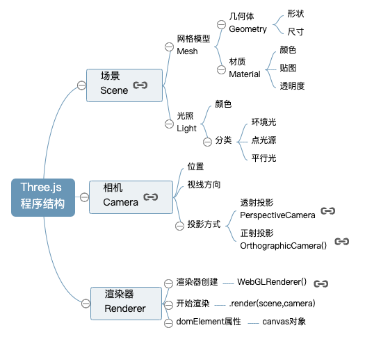

# Three.js

:::tip 前言
`Three.js` 是一个开源的应用级 `3D JavaScript` 库，其底层是基于`WebGL`，它使浏览器能借助系统显卡在`canvas`中绘制 3D 画面。

`WebGL`自身只能绘制点（points）、线（lines）和三角形（triangles），而`Three.js`对`WebGL`进行了封装，使我们能够方便地创建 物体（objects）, 纹理（textures）, 进行 3D 计算等操作。
:::

刚开始接触`Three.js`,很多概念和 api 都不了解，在这里我们首先看一个案例，通过案例来学习，将可以更清晰的知道`Three.js`的使用。

## 示例

有过`WebGL`基础的人可以知道，`WebGL`只能绘制点、线、三角形，所有图形的基础都是三角形，而`Three.js`则提供了更丰富的功能，它内部封装了立方体、球体、圆柱体等，我们可以通过这些基础图形来创建更加复杂的图形。

### 场景 `Scene`

:::tip 场景
场景是一个三维空间，可以把场景想象成一个房间，里面可以放物体、相机、光源等。
:::

```js
// 创建场景
var scene = new THREE.Scene();
```

### 创建几何体

```js
var geometry = new THREE.SphereGeometry(60, 60, 60); //创建一个球体几何对象
var geometry = new THREE.BoxGeometry(100, 100, 100); //创建一个立方体几何对象Geometry
```

### 创建网格、材质

:::tip mesh
材质+几何体就是一个 mesh，`Three.js`中比较常用的用漫反射、镜面反射两种材质，另外，还可以引入外部图片贴到物体表面，成为纹理贴图。
:::

```js
const geometry = new THREE.BoxGeometry();
const material = new THREE.MeshBasicMaterial({ color: 0x00ff00 });
this.cube = new THREE.Mesh(geometry, material);
this.scene.add(this.cube);
```

### 光源设置

::: tip 光源
有了场景、几何体、材质、相机等，还需要光源，如果没有光源，放在场景里的相机也看不到任何东西，因此需要往场景里添加光源。`Three.js`支持的光源有点光源、平行光、聚光灯、环境光等。
:::

```js
/**
 * 光源设置
 */
//点光源
var point = new THREE.PointLight(0xffffff);
point.position.set(400, 200, 300); //点光源位置
scene.add(point); //点光源添加到场景中
//环境光
var ambient = new THREE.AmbientLight(0x444444);
scene.add(ambient);
```

#### 环境光

:::tip 环境光
环境光会均匀照亮场景中所有的物体。环境光没有方向。
:::

#### 平行光

:::tip 平行光
平行光沿着特定方向发射光，从它发出的光线都是平行的。
:::

#### 点光源

:::tip 点光源
点光源是从一个点向各个方向发射的光源。
:::

#### 聚光灯

:::tip 聚光灯
聚光灯是光线从一个点沿一个方向射出，随着光线照射的距离变远，光线圆锥体的尺寸也会逐渐变大。
:::

### 相机 `Camera`

:::tip 相机
在`Three.js`中，想要将物体能够在场景中呈现，我们需要往场景中添加一个相机，相机可以用来确定位置、方向、角度等。
:::

```js
this.camera = new THREE.PerspectiveCamera(75, window.innerWidth / window.innerHeight, 0.1, 1000);
this.camera.position.set(0, 0, 3); //设置相机位置
this.camera.lookAt(this.scene.position); //设置相机方向(指向的场景对象)
```

在`Three.js`中，一共有两种相机，分别是透视相机和正交相机。

#### 透视相机

:::tip 透视相机
透视相机的特点：近大远小，符合人眼观察事物的特点。
:::

#### 正交相机

:::tip 正交相机
正交相机的特点：无论物体距离相机远或近，在最终渲染的图片中物体的大小都保持不变。
:::

### 渲染器 `Renderer`

```js
this.renderer = new THREE.WebGLRenderer({ canvas: this.canvas });
// 设置画布的大小
this.renderer.setSize(500, 500); //设置渲染区域尺寸
this.renderer.setClearColor(0xb9d3ff, 1); //设置背景颜色

render() {
  this.renderer.render(this.scene, this.camera);
}
```



经过以上的步骤设置之后，我们将在页面中看到如下图形：

<Three01 />

<script setup>
    import Three01 from '../components/demo/three01.vue'
</script>

## 总结

1. 了解 `Three.js`的定义
2. 通过一个案例学习`Three.js`的使用

## 参考文档

[Three.js](http://www.webgl3d.cn/Three.js/)
