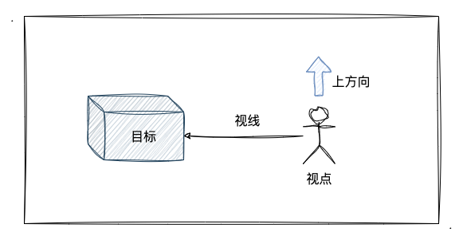
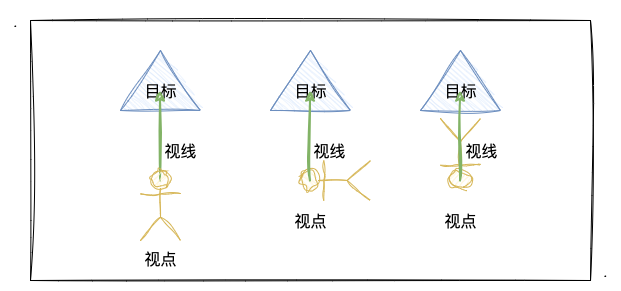

# WebGL 相机

在上一小节中，我们使用 WebGL 绘制了一个立方体，并且可以通过鼠标点击，旋转，从不同的角度观察立方体。

我们以不同角度、距离、方向观察立方体，其实就是一个相机，和现实生活中的相机类似，从不同方向、距离去拍摄同一物体，观察到的画面是不相同的。相机代表着我们观察一个 3D 图形的观察点，从不同的角度、距离去拍摄一些 3D 的物体看到的效果是不一样的。

:::tip
问：在三维场景中观察一个物体需要具备什么条件呢？

答：确定相机和观察目标的关系。
:::

确定相机和观察目标的关系需要引入三个概念，分别是：

- **视点**。观察点，也可以理解为三维坐标中的相机位置，是视线的起点。

- **观察目标点**。被观察的目标点，视线将穿过目标点且继续延伸。

- **上方向**。图形绘制到屏幕时向上的方向，将配合视点、目标点固定图形的显示方位。

视点，目标点，上方向之间的关系如下图所示：



有了视点，目标点，我们可以知道观察的目标和视线，但是正着看、倒着看、反着看，观察到的效果是不一样的，因此还需要上方向。

为了更好的理解上方向，可以看下面这张图：



总结：视点、目标点、上方向三者缺一不可。

## 视图矩阵

相机可以观察物体的关键是视图矩阵，那么视图矩阵是什么，它长什么样子的，接下来让我们揭开它神秘的面纱.let's go!!!

在世界坐标系中，有场景、相机。相机存在于世界坐标系中，而它自身有一个自己的坐标系，称为相机坐标系，同时相机有视点、目标点、上方向，可以根据这三个条件计算相机坐标系的位置。

:::tip 什么是视图矩阵
当我们用相机观察场景中的物体时，把世界坐标系的场景放到对应的相机坐标系中，就可以绘制出图像最终的形态。而要实现图形最后绘制在屏幕上的样子，依靠的就是这个视图矩阵，视图矩阵的作用就是将世界坐标系和相机坐标系做一个转换。即视图矩阵可以用来表示相机在场景中的状态，它能确定最终图形绘制到屏幕上的样子。
:::

视图矩阵默认位于原点位置，面向屏幕朝 Z 轴的负方向。

:::tip 视图矩阵的作用
把相机坐标系跟世界坐标系做一个转换，把世界坐标系中的场景"放到"相机里。
:::

## 用相机观察物体

使用相机观察立方体，需要借助视图矩阵，另外，我们知道在三维场景观察物体时，还需要视点，目标点，和上方向这三个要素，因此需要定义三个矢量和一个视图矩阵。对于视图矩阵，我们直接使用 lookAt 函数来生成。

```js
// 着色器源码
const vertexCode = `
    attribute vec4 a_Position;
    attribute vec4 a_Color;
    varying vec4 v_Color;
    uniform mat4 u_ViewMatrix;
  
    void main () {
      // 定义视图矩阵
      gl_Position = u_ViewMatrix * a_Position;
      v_Color= a_Color;
    }
  `

const fragmentCode = `
    precision mediump float;
    varying vec4 v_Color;
  
    void main () {
      gl_FragColor = v_Color;
    }
  `

// 定义相机视点，观察目标点，上方向
const camera = new Vector3(0, 0, 0)
const target = new Vector3(0, 0, -1)
const up = new Vector3(0, 1, 0)
```

将上面定义的三个矢量放进 `Matrix4` 中的 `lookAt` 方法里面就可以创建出视图矩阵

```js
u_ViewMatrix = gl.getUniformLocation(program, 'u_ViewMatrix')
const matrix = new Matrix4()
matrix.lookAt(camera, target, up)
gl.uniformMatrix4fv(u_ViewMatrix, false, matrix.elements)
```

示例如下：通过点击相机观察的方向，可以观察物体的不同效果

下面的示例有两种选择，分别是：同时改变相机和观察点，只改变相机位置。

对于同时改变相机和观察点，可以观察到，看到的物体效果是一样的，没有改变，而只改变相机位置将可以看到不同的效果。

<WebglCamera />

<script setup>
    import WebglCamera from '../components/demo/WebglCamera.vue'
</script>

结论：

- 在 WebGL 中，移动相机和移动场景是等价的，但方向相反。
- 同时改变相机和观察点位置。类似于把相机平移，此时场景会向着相机的反方向平移。
