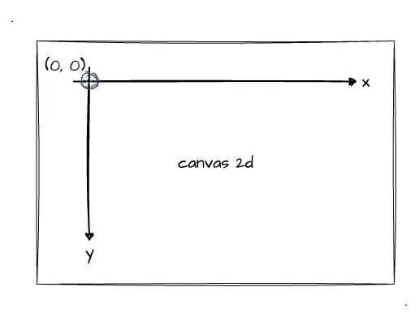

# WebGL 基础知识

## WebGL 是什么？

:::tip [维基百科](https://zh.wikipedia.org/wiki/WebGL)定义
WebGL 是一种 JavaScript API，用于在不使用插件的情况下在任何兼容的网页浏览器中呈现交互式 2D 和 3D 图形。WebGL 完全集成到浏览器的所有网页标准中，可将影像处理和效果的 GPU 加速使用方式当做网页 Canvas 的一部分。WebGL 程序由 JavaScript 编写的句柄和 OpenGL Shading Language（GLSL）编写的着色器代码组成，该语言类似于 C 或 C++，并在电脑的图形处理器（GPU）上执行。
:::

也就是说，我们无需安装各种环境，仅使用 JavaScript 和 GLSL 代码，就可以在浏览器中实现 2D、3D 图形效果。

## WebGL 三要素

WebGL 程序运行三要素：

1. canvas（HTML5 标签）
2. JavaScript（脚本语言）
3. GLSL ES（着色器语言）

只要具备了这三个要素，我们就可以在浏览器上实现各种三维图形的网页。
:::info GLSL
GLSL ES（着色器语言）用于计算机图形编程，运行在 GPU 中。
:::

## WebGL 坐标

作为一名前端开发者，想必大家对于 canvas 已经很熟悉了，既然讲到 WebGL 坐标，那就先跟 canvas 坐标做一个对比。在 canvas 2d 的坐标系中，默认原点是在左上角的，如下图所示：

而 WebGL 的坐标系如下所示，它的坐标原点跟我们以前学过的数学坐标系很像，处于中心位置。另外，WebGL 它的坐标范围跟 canvas 2d 坐标范围也不相同，WebGL 的坐标范围是（-1，1）。

在使用 WebGL 的时候，需要进行一定的转换，举个例子 🌰：

假设设置的 canvas 的宽高为 600\*300，在坐标系的第一象限绘制一个直角三角形，如下所示：

那么这个直角三角形三个顶点的坐标换算为 WebGL 坐标系后分别为：(0,0),(1,0),(0,1)

## WebGL 渲染管线流程图

学习 WebGL 只要对下面的这张流程图建立整体的概念，那么就算是学习成功 60%了。不过目前也不必对每个流程细节了解的非常清楚，接下来将会详细讲解。

