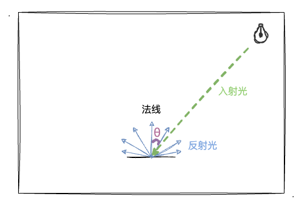
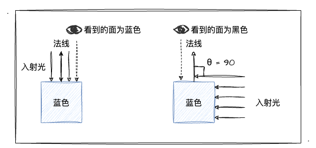

# WebGL 光照

## 光照的本质

:::tip 光照的本质
在现实生活中，我们可以看到很多“光照”的影子，比如说看到物体的阴暗面、影子等自然现象。在 WebGL 的世界中，光照起到了什么效果呢？简单来说，光照有什么作用呢？
:::

在学习`WebGL`的时候，我们经常会使用到`片元着色器`这个概念，`片元着色器`其实就是对图形不同位置的颜色做一些变化和控制，逐片元操作是在图形装配、光栅化后，对每一个像素绘制上颜色的过程。光照效果归根结底就是对图像每个部位颜色的控制、调节，而最终展示到屏幕上的颜色则是通过**入射光颜色、角度、和物体表面颜色**等参数**共同计算**出来的。

## 光源类型

基本的光源大致可以分为三种，分别是：

- 点光源：由点向周围发散的光（如灯泡），可以用**光源位置**和**颜色**来定义点光源。
- 平行光：光线之间相互平行，可以用**方向**和**颜色**来定义平行光。
- 环境光：从各光源发出后被反射到物体表面的光（周边物体反射过来的光），仅指定**颜色**即可定义环境光。

## 反射类型

:::tip 反射类型
仅有光源还是不能确定物体最终绘制的颜色，还需要考虑物体表面的颜色和光的反射方向、颜色。于是有两种物体表面反射光的方式：
:::

- 漫反射：主要针对**平行光**或者**点光源**，反射光在**各个方向上都是均匀**的（一种理想反射模型）
- 环境反射：主要针对**环境光**，其反射光其实就是**环境入射光的反方向**。

### 漫反射

:::tip 漫反射和镜面反射的区别：

- 漫反射：漫反射的表面是不光滑的，当入射光照射物体时，它会将该入射光向四面八方反射。
- 镜面反射：镜面反射的表面是光滑的，它会使光沿着同一个方向反射出去，如果入射光是一段平行光，那它反射后依然是一段平行光。
  :::

上图为物体经过漫反射照射后，产生的漫反射光。物体被入射光照射后，向四面八方反射进入人的眼睛时，我们就可以看见物体，并能知道该物体的颜色。那么，漫反射光的颜色是怎样形成的呢？

1. 入射光颜色
2. 物体表面颜色
3. 入射光与物体表面夹角：入射角为入射光线与物体表面的法线的夹角

:::tip 漫反射公式
漫反射光颜色 = 入射光颜色 x 物体表面颜色 x cosθ = 入射光颜色 x 物体表面颜色 x (光线方向 · 法线方向)
:::

#### 漫反射光特点

1. 当`θ`为`0°`时，入射光与表面**垂直**，`cosθ` 的**值为`1`**，此时入射光正射表面。
2. 当`θ`为`90°`时，入射光与表面**平行**，`cosθ` 的值为`0`，没有入射光照射到物体表面，此时应该为**黑色**。

如上图所示，当入射光**垂直**照射眼睛看着的面时，我们可以看到的面应该为**蓝色**；当入射光**平行**照射眼睛看着的面时（没有照射到面，`0`为`90°`），我们看到的面应该为**黑色**。

### 环境反射

:::tip
上面的漫反射针对的是平行光和点光源，而环境反射针对的是环境光。环境光仅需要定义**颜色**就可以定义环境光。因此其环境反射光颜色的计算也相对简单，公式如下：

**环境光反射颜色 = 入射光颜色 \* 物体表面颜色**
:::

:::tip 同时有平行光和环境光的计算公式
反射光颜色 = 漫反射光颜色 + 环境反射光颜色
:::

## 示例

如下图所示，我们写了一个使用平行光产生漫反射现象的蓝色立方体 demo。

<Light type="parallelLight" />

通过调整 x,y,z 不同方向的值，我们可以观察到不同的结果，比如当光线平行于 x 轴，即调整光线方向的值为(1,0,0)时，可以观察到立方体垂直于 x 轴的面为蓝色，其余面为黑色；当调整为(0,0,0)时，立方体所有的面都为黑色。

在上面这个示例中，默认是只有平行光，环境光是默认关闭的，你可以通过控制环境光是否开启来观察图形的结果，当开启环境光后，可以观察光线平行于 x 轴，即调整光线方向的值为(1,0,0)时，立方体垂直于 x 轴的面为蓝色，其余面为暗蓝色；当调整为(0,0,0)时，立方体所有的面并不都为黑色，与只添加平行光是否区别的。
