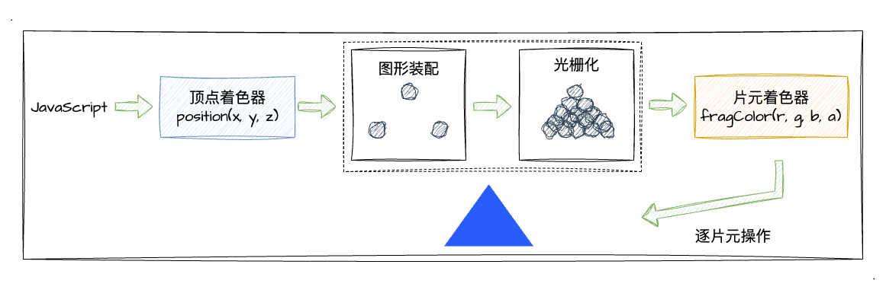
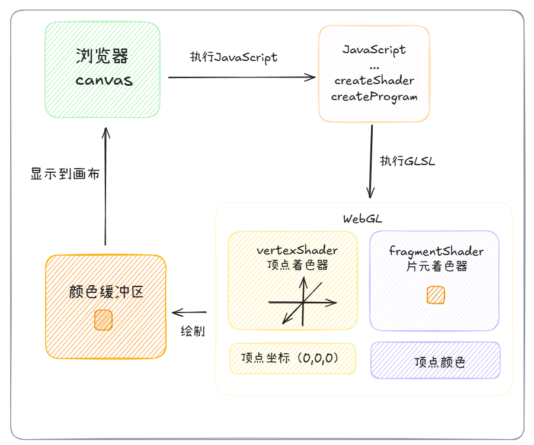

# WebGL 绘制点

:::tip
在上一小节中，我们已经学习了 WebGL 运行需要的三要素，并且也知道了 WebGL 的坐标系统。接下来我们将通过 WebGL 绘制一个简单的二维图形，了解 WbGL 程序的代码实现。

WebGL 绘图需要一个比较重要的要素就是 GLSL SE 着色器语言，下面就看看什么是着色器，在程序中怎么使用？
:::

## 什么是着色器？

WebGL 有两种着色器，分别是：

- 顶点着色器：顶点着色器用来描述顶点属性，如顶点坐标位置。在三维空间中可以描述为`(x,y,z)`这样一个点。
- 片元着色器：片元着色器用于逐片元的处理颜色。片元其实指的是每一个像素，逐片元即计算当前绘制对象每一个像素的颜色值。

当把顶点着色器和片元着色器结合起来成对使用时，就形成了一个着色器程序。着色器程序在 GPU 中运行，根据我们设置的一系列值，调用 WebGL 相关的 api，就可以绘制出各种图形。

以下通过 WebGL 绘制一个三角形来加深对着色器的理解：


如上图所示，当使用 WebGL 绘制一个三角形的时候，会经过以下步骤：

1. 顶点着色器调用三次（处理三个顶点），然后再经过图形装配和光栅化的过程。光栅化其实就是将装配后的图形转换成每一个像素点。
2. 片元着色器对光栅化后的图形的每一个像素点进行着色处理。

即经过三次顶点着色器处理，画出三个顶点，然后三个顶点进行连接进行图形装配，然后再运行 n 次片元着色器，对每一个像素进行着色处理。

### 着色器代码

#### 数据类型

| 类型  | 描述                                                 |
| ----- | ---------------------------------------------------- |
| float | 浮点数                                               |
| vec4  | 由 4 个浮点数组成的矢量 (float, float, float, float) |

#### 顶点着色器内置变量

| 变量名       | 类型  | 描述             | 默认值 |
| ------------ | ----- | ---------------- | ------ |
| gl_Position  | vec4  | 顶点位置、坐标   | -      |
| gl_PointSize | float | 点的尺寸（像素） | 1.0    |

#### 片元着色器内置变量

| 变量名       | 类型 | 描述                              | 默认值 |
| ------------ | ---- | --------------------------------- | ------ |
| gl_FragColor | vec4 | 指定片元（像素）颜色，格式为 RGBA | -      |

#### 源码

##### 顶点着色器源码

```JavaScript
//顶点着色器源码
var vertexShaderSource = `
          // 定义了一个名为 a_Position，类型为 vec4 的 attribute 变量
          attribute vec4 a_Position;
          void main () {
              // 顶点坐标
              gl_Position = a_Position;
              // 顶点渲染像素大小
              gl_PointSize = 24.0;
          }
```

##### 片元着色器源码

```JavaScript
//片元着色器源码
var fragShaderSource = `
            precision mediump float;
            uniform vec4 u_FragColor;
            void main () {
            // 顶点颜色 (R, G, B, A)
            gl_FragColor = u_FragColor;
          }
        `
```

## 绘制点-示例

下面将使用 WebGL 绘制一个点：

1. 创建 canvas,获取绘图上下文

```JavaScript
<canvas id="webgl" width="500" height="200" style="background-color: black"></canvas>

//通过getElementById()方法获取canvas画布
canvas = document.getElementById('webgl')
//通过方法getContext()获取WebGL上下文
gl = canvas?.getContext('webgl')
```

2. 创建着色器

```JavaScript
// 创建顶点着色器
var vertexShader = gl.createShader(gl.VERTEX_SHADER) //创建顶点着色器对象
gl.shaderSource(vertexShader, vertexShaderSource) //引入顶点着色器源代码
gl.compileShader(vertexShader) //编译顶点着色器

// 创建片元着色器
var fragmentShader = gl.createShader(gl.FRAGMENT_SHADER) //创建片元着色器对象
gl.shaderSource(fragmentShader, fragmentShaderSource) //引入片元着色器源代码
gl.compileShader(fragmentShader) //编译片元着色器
```

3. 创建着色器程序

```JavaScript
//创建着色器程序
var program = gl.createProgram()
gl.attachShader(program, vertexShader) //为程序program添加顶点着色器
gl.attachShader(program, fragmentShader) //为程序program添加片元着色器
gl.linkProgram(program) // 连接 顶点着色器 和 片元着色器，也就是组合成对
gl.useProgram(program) // 应用着色器程序，告诉 WebGL 绘制的时候使用这个着色程序
```

着色器程序 `createProgram` 用于连接顶点、片元着色器.

你也可以这样理解，`GLSL` 是以字符串的形式"嵌入" `JavaScript` 中的。这段着色器代码最终将会交由 GPU 去执行。

4. 开始绘制

```JavaScript
gl.drawArrays(gl.POINTS, 0, 1)
```

使用`gl.drawArrays`这个绘图函数就可以完成一个点的绘制。`gl.drawArrays`参数说明如下：

|               | 参数值               | 参数值说明                                                                           | 返回值 |
| ------------- | -------------------- | ------------------------------------------------------------------------------------ | ------ |
| gl.drawArrays | (mode, first, count) | 1. mode： gl.POINTS 绘制单个点 2. first： 指定开始绘制的点 3.count：指定绘制多少个点 | -      |

<Point />

<script setup>
    import Point from '../components/demo/Point.vue'
</script>

以上就完成了一个点的绘制。

整个执行阶段的流程图如下所示：



## 总结

1. 了解着色器的基本原理。
2. 学习如何编写着色器代码，源码等。
3. 完成一个点的绘制。
